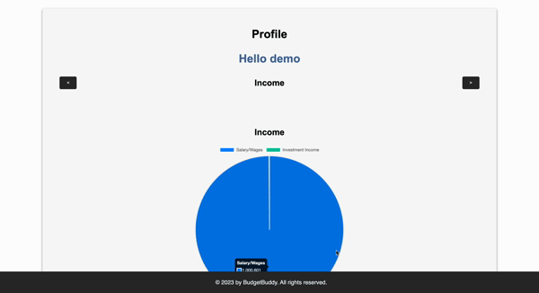
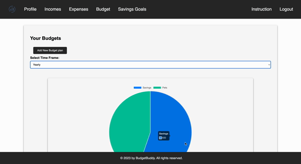

# BudgetBuddy


## Table of Contents

- [Overview](#overview)
- [Technologies](#technologies)
- [Features](#features)
- [Installation](#installation)
- [Screenshots](#screenshots)
- [Future Directions](#future-directions)
- [Contact](#contact)

## Overview

**BudgetBuddy** is a comprehensive financial management web application that allows users to track and manage their budgets, expenses, and incomes seamlessly.

## Technologies

- **Frontend**: React, Redux
- **Backend**: Node.js, Express
- **Database**: MongoDB

## Features

- **Budget Management**: Set monthly or yearly budgets and track your spending against them.
- **Expenses Tracking**: Categorize and record your daily expenses with intuitive visuals.
- **Income Tracking**: Keep track of all your income sources and view them in a consolidated manner.
- **User Profile**: Personalize your experience and set financial goals.
- **Authentication**: Secure user registration and login functionality.
- **Interactive Visuals**: Pie charts and bar graphs for better financial insights.

## Installation

### Backend

1. Navigate to the `backend` directory.
2. Install the required packages:
   ```bash
   npm install
3. Set up your environment variables in `backend/config/keys.js`.
4. Start the server:
   ```bash
   npm start

### Frontend

1. Navigate to the `frontend` directory.
2. Install the required packages:
   ```bash
   npm install
3. Start the React app:
   ```bash
   npm start

## Screenshots

- **User Dashboard**: 




- **Budgeting Tab**: 




- **Expenses Tab**: 


## Code Modularization and Use of Modals

In the `ExpensesPage` component, we've taken a modular approach to structure the code. This not only makes the code more readable but also easier to maintain and scale.

```javascript
function ExpensesPage() {
  const [showModal, setShowModal] = useState(false);
  const openModal = () => setShowModal(true);
  const closeModal = () => setShowModal(false);
  const [isLoading, setIsLoading] = useState(true);
  return (
    <div>
      <Modal showModal={showModal} closeModal={closeModal}>
        <ExpenseInput />
      </Modal>
      <div className="expenses-page-container">
        <h2>Your Expenses</h2>
        <button onClick={openModal}>Add New Expenses</button>
        <div className="income-container">
          <div id='expense-list'>
            <ExpenseList setIsLoading={setIsLoading} />
          </div>
          {!isLoading && (
            <div id='expense-chart'>
              <ExpensePieChart />
            </div>
          )}
        </div>
      </div>
    </div>
  );
}

export default ExpensesPage;
```

### Key Highlights:

- **Modularization**: The code is structured into distinct components like `Modal`, `ExpenseInput`, `ExpenseList`, and `ExpensePieChart`. This modularization allows for better separation of concerns, where each component handles its specific functionality.

- **Use of Modals**: The `Modal` component is used to display the `ExpenseInput` form. This provides a better user experience by allowing users to input expenses without navigating away from the current page. The modal can be toggled on and off using the `showModal` state and the associated `openModal` and `closeModal` functions.

- **Conditional Rendering**: The `ExpensePieChart` component is conditionally rendered based on the `isLoading` state. This ensures that the pie chart is only displayed once the data is fully loaded, providing a smoother user experience.

By adopting such practices, the code remains clean, organized, and efficient, making it easier for developers to understand and modify in the future.


## Future Directions

- **Mobile App**: Develop a mobile version of BudgetBuddy for on-the-go budgeting.
- **Financial Insights**: Implement AI-driven insights to provide users with financial advice based on their spending habits.
- **Integration with Banks**: Allow users to link their bank accounts for real-time transaction tracking.

## Contact

For any questions or feedback, please reach out to [Hari Masoor](mailto:harimasoor@gmail.com), [Farivar Amiri](farivaramiri@gmail.com), [Elilta Abrham](eliltatabrham@gmail.com), Dominic Chan.
