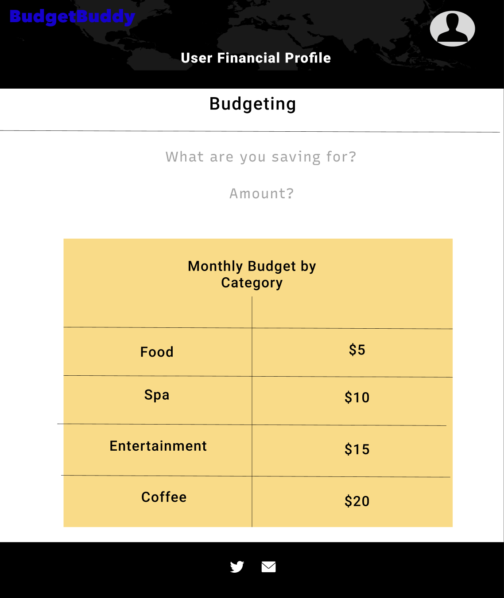
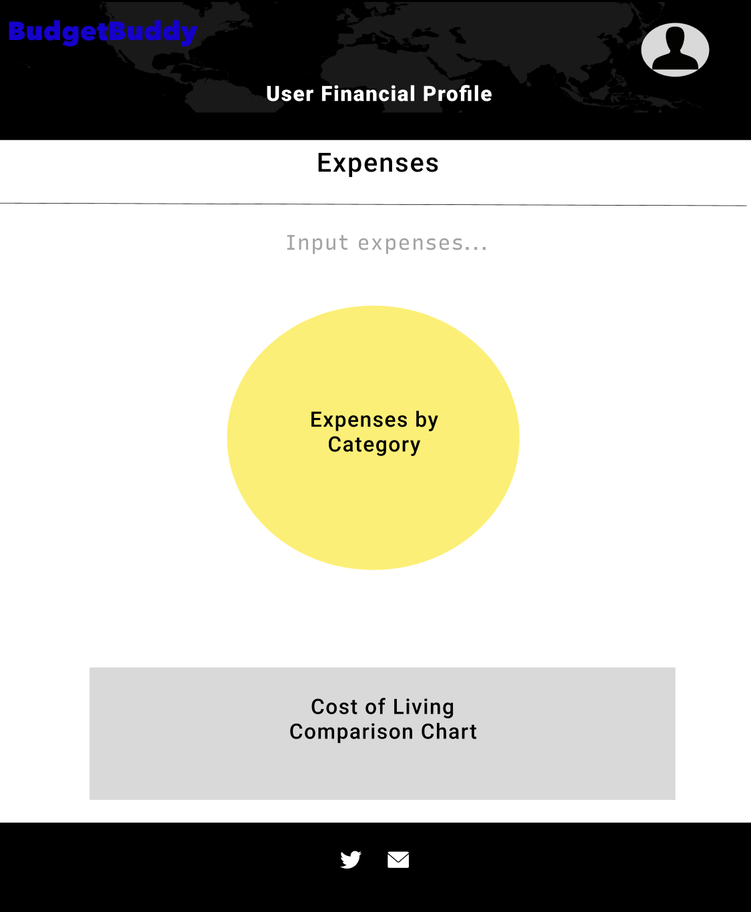

## BudgetBuddy

### BudgetBuddy

BudgetBuddy is a webApp that assists users in managing their personal finances, tracking expenses, and achieving financial aspirations.

## Background and Overview

In today's complex financial landscape, individuals are searching for streamlined platforms to monitor and optimize their finances. BudgetBuddy addresses this need by offering a consolidated solution to track expenses, incomes, and budgetary goals.

## Functionality & MVP

- [ ] User authentication with CSRF protection, Google Login, and traditional email/password.
- [ ] User dashboard presenting charts for income, expenses, savings, etc.
- [ ] Input forms for daily expenses and monthly income.
- [ ] Budgeting tools facilitating planning and visualization.
- [ ] Integration with a cost-of-living API for financial insights.
- [ ] Production README.

  <kbd>
    
  </kbd>

  <kbd>
    
  </kbd>

  <kbd>
    
  </kbd>

#### Bonus Features
- [ ] OCR API integration to scan receipts and categorize expenses.
- [ ] Alerts for nearing or exceeding budget limits.
- [ ] Recommendations based on spending behavior.
- [ ] Integration with other financial data sources or APIs.

## Technologies & Technical Challenges

BudgetBuddy leverages the MERN stack, consisting of MongoDB, Express.js, React, and Node.js, ensuring a dynamic, scalable, and interactive user experience.

### Backend: MongoDB/Express
- Store comprehensive user data including financial profiles, expenses, budgets, and receipt scans.
- Ensure data integrity and security.

### Frontend: React/Node.js
- Provide an interactive dashboard displaying user financial data.
- Facilitate smooth user interactions for budget planning, expense tracking, and data visualization.

#### Technical Challenges:

**OCR API Integration**:
- Efficiently extracting and categorizing data from scanned receipts.
- Handling potential inaccuracies in OCR data extraction.
  
**Backend: MongoDB/Express**:
- Structuring the database to accommodate various financial data types and relationships.
- Ensuring data security, especially with sensitive financial information.
  
**Frontend: React/Node.js**:
- Designing an intuitive UI/UX for a diverse range of financial functionalities.
- Handling real-time data visualization as users input new financial data.
- Ensuring the application's responsiveness across various devices and screen sizes.

## Group Members & Work Breakdown

**Hari Masoor**, Flex
**Elilta Abrham**, Flex
**Farivar Amiri**, Front-End
**Dominic Chan**, Backend

### Day 1
- Set up the basic MERN stack project structure - **Elilta** and **Dominic**.
- Begin user authentication backend - **Hari**.
- Research potential APIs for cost of living - **Farivar**.

### Day 2
- Complete user authentication backend and start frontend - **Hari** and **Dominic**.
- Set up database schemas for income, expenses, and budgets - **Elilta**.
- Begin frontend dashboard design - **Farivar**.

### Day 3
- Implement charts for the dashboard using a library like Chart.js or D3 - **Dominic**.
- Integrate user income and expense data into charts - **Elilta** and **Hari**.
- Begin work on budgeting tools - **Farivar**.

### Day 4
- Complete the budgeting tools and integrate them into the user dashboard - **Farivar** and **Hari**.
- Implement input forms for expenses and income - **Elilta**.
- Test API integrations - **Dominic**.

### Day 5
- Refine UI/UX and polish frontend components - **Dominic** and **Farivar**.
- Ensure robust error handling and validation for all forms - **Hari**.
- Optimize backend queries and routes - **Elilta**.

### Day 6
- Conduct thorough testing of all features - **All team members**.
- Finalize the production README.md - **Elilta**.
- Address any bugs or issues identified during testing - **All team members**.

### Day 7
- Final review and deployment preparations - **All team members**.
- Deploy the app to a platform like Heroku or Vercel - **Dominic** and **Hari**.

 
